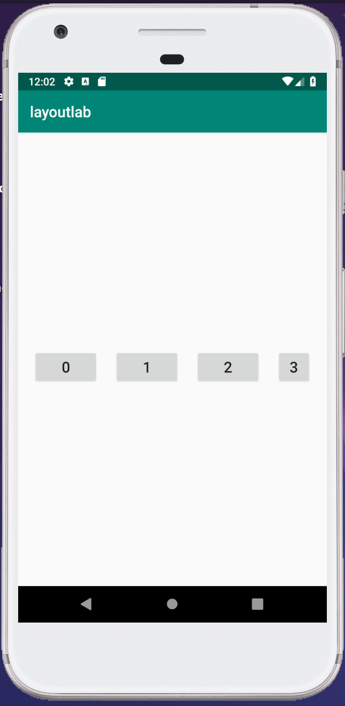
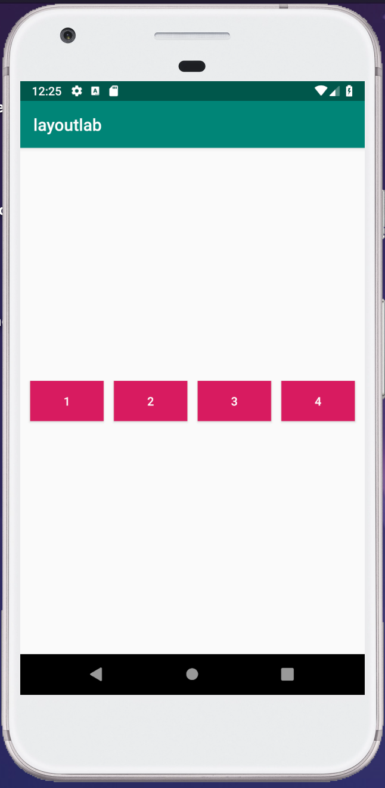

# layoutlab

Setup instructions if you'd like to follow along:

* Clone the project repo: https://github.com/harshitha-akkaraju/layoutlab.git
* Open the project / import the project into Android studio

## Target Layout using XML

*challenge: what constraints would you add to get the buttons to be the same size?*

## Target Layout Programmatically

**Note**: Move the intent filter in `AndroidManifest.xml` to toggle between xml layout and programmatic layout views.
